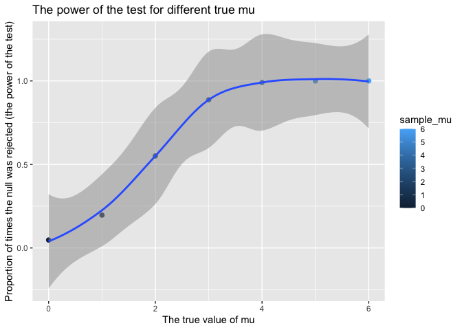

p8105_hw5_xx2416
================
Xicheng Xie
2022-11-08

# Problem 1

-   First, create the tidy df containing data from all participants,
    including the subject ID, arm, and observations over time

``` r
ls_df<-tibble(
  path=list.files("data")) %>%
  mutate(
    path=str_c("data/",path),
    data=map(.x=path,~read.csv(.x))) %>%
  unnest(data) %>% 
  separate(path,c("path","arm","id","csv")) %>% 
  select(-path,-csv) %>% 
  mutate(id=as.factor(id),
         arm=recode_factor(arm,con="control",exp="experiment")) %>% 
  pivot_longer(
    week_1:week_8,
    names_to = "week",
    values_to = "observation",
    names_prefix = "week_"
  )
```

-   Make a spaghetti plot showing observations on each subject over time

``` r
ls_df %>% 
  ggplot(aes(x=week,y=observation,group=id))+
  geom_point(size=0.5)+
  geom_line(aes(color=id))+
  stat_summary(aes(group=1),fun = mean,size=0.5)+
  facet_grid(~arm)
```

    ## Warning: Removed 8 rows containing missing values (geom_segment).
    ## Removed 8 rows containing missing values (geom_segment).

<!-- -->

We can tell from the plot above that the observations of the
experimental arm increase significantly over weeks, while those of the
control arm keep stable.

# Problem 2

``` r
homicides_raw<-read.csv("homicide-data.csv")

homicides_df<-read.csv("homicide-data.csv") %>% 
  mutate(city_state=str_c(city,state,sep = ","),
         case=if_else(disposition %in% c("Closed without arrest","Open/No arrest"),"unsolved","solved")
           ) %>% 
  group_by(city_state) %>% 
  summarize(n_obs=n(),
            n_unsolved=sum(case=="unsolved"))
```

**Description of the raw data**: the raw df contains 51 rows and 3
columns and it works on the research and analysis of the unsolved
homicides in 50 large U.S. cities. The `homicides_df` dataset includes
the location of the killing, whether an arrest was made and, in most
cases, basic demographic information about each victim.

``` r
B_MD<-prop.test(
  homicides_df %>% filter(city_state=="Baltimore,MD") %>% pull(n_unsolved),
  homicides_df %>% filter(city_state=="Baltimore,MD") %>% pull(n_obs)) %>% tidy()

B_MD %>% pull(estimate)
```

    ##         p 
    ## 0.6455607

In the tidy dataframe `B_MD`, the estimated proportion of homicides that
is unsolved of Baltimore is 0.6455607, and the 95% confidence interval
is from 0.6275625 to 0.6631599

-   Then run `prop.test` for each of the cities in `homicides_df`, and
    extract both the proportion of unsolved homicides and the confidence
    interval for each.

``` r
homicides_estimate<-homicides_df %>% 
  mutate(estimate_df=map2(.x=n_unsolved,.y=n_obs,~prop.test(.x,.y)),
         estimate_df=map(estimate_df,tidy)) %>% 
  unnest(estimate_df) %>%
  filter(!city_state=="Tulsa,AL") %>% 
  select(city_state,estimate,conf.low,conf.high)
```

    ## Warning in prop.test(.x, .y): Chi-squared approximation may be incorrect

-   Create a plot that shows the estimates and CIs for each city

``` r
homicides_estimate %>%
  mutate(
    city_state=fct_reorder(city_state,estimate)
  ) %>% 
  ggplot(aes(x=city_state,y=estimate,ymin=conf.low,ymax=conf.high,color=city_state))+
  geom_hline(yintercept = 0.5,linetype = 2)+
  geom_pointrange(size=0.1)+
  coord_flip()+
  theme(legend.position = "none")+
  labs(
    y="estimate proportion of unsolved homicides",
    x="city_state"
  )
```

<!-- -->

# Problem 3

-   First, we write the `get_sim_t` function to simulate datasets and
    obtain the esimate and p-value of `t.test`, and test this function
    from µ=0.

``` r
x=tibble(rnorm(30,0,5)) %>% 
  t.test() %>% 
  tidy() %>% 
  select(estimate,p.value)

get_sim_t= function(mu, n=30, sigma = 5) {
  
  sim_data = tibble(
    x = rnorm(n, mean = mu, sd = sigma),
  )
  
  sim_data %>%
  t.test() %>% 
  tidy() %>% 
  select(estimate,p.value)
}

# test: mu=0,iteration=5000
sim_results_df_0 = 
  expand_grid(
    sample_mu = 0,
    iter = 1:5000
  ) %>% 
  mutate(
    estimate_df = map(sample_mu,get_sim_t)
  ) %>% 
  unnest(estimate_df)
```

-   Repeat the above for µ={1,2,3,4,5,6}, and get the whole simulation
    results df

``` r
sim_results_df = 
  expand_grid(
    sample_mu = c(0,1,2,3,4,5,6),
    iter = 1:5000
  ) %>% 
  mutate(
    estimate_df = map(sample_mu,get_sim_t)
  ) %>% 
  unnest(estimate_df)
```

-   Make a plot showing the proportion of times the null was rejected
    (the power of the test) on the y axis and the true value of µ on the
    x axis.

``` r
sim_results_df %>%
  filter(p.value<0.05) %>% 
  group_by(sample_mu) %>% 
  summarize(n_rejected=n()) %>% 
  mutate(prop_rejected=n_rejected/5000) %>% 
  ggplot(aes(x = sample_mu, y = prop_rejected,color=sample_mu)) +
  geom_point( size = 2) +
  geom_smooth(alpha = .5, size = 1) +
  labs(
    x = "The true value of mu",
    y = "Proportion of times the null was rejected (the power of the test)",
    title = "The power of the test for different true mu"
    )
```

    ## `geom_smooth()` using method = 'loess' and formula 'y ~ x'

<!-- --> As
showed in the plot above, the power of the one-sample t-test increases
as the true value of mu increases. For the relationship between effect
size and power, If statistical power is high, the likelihood of deciding
there is an effect, when one does exist, is high. Power is
`1-type II error` (type II error is the probability of wrongly
concluding there is no effect when one actually exists). Like
statistical significance, statistical power depends upon effect size and
sample size. If the effect size of the intervention is large, it is
possible to detect such an effect in smaller sample numbers, whereas a
smaller effect size would require larger sample sizes.

-   Make the two plots

1.  Show the relationship between the average estimate of mu and the
    true value of mu

``` r
sim_results_df %>% 
  group_by(sample_mu) %>% 
  summarize(estimate_mu=mean(estimate)) %>%
  ggplot(aes(x=sample_mu,y=estimate_mu,color=sample_mu))+
  geom_point()+
  geom_smooth(alpha = .5)+
  labs(
    x="the true value of mu",
    y="the average estimate value of mu"
  )
```

    ## `geom_smooth()` using method = 'loess' and formula 'y ~ x'

<!-- --> 2.
Show the average estimate of mu only in samples for which the null was
rejected on the y axis and the true value of mu on the x axis.

``` r
sim_results_df %>% 
  filter(p.value<0.05) %>% 
  group_by(sample_mu) %>% 
  summarize(estimate_mu=mean(estimate)) %>%
  ggplot(aes(x=sample_mu,y=estimate_mu,color=sample_mu))+
  geom_point()+
  geom_smooth(alpha = .5)+
  labs(
    x="the true value of mu",
    y="the average estimate value of mu (the null was rejected )"
  )
```

    ## `geom_smooth()` using method = 'loess' and formula 'y ~ x'

<!-- -->

-   We can find out from the plot that the sample average of µ (which is
    the estimate µ) across tests for which null is rejected
    approximately equal to the true value of µ (which is the sample µ).
    Since the power increases as the true value of µ increases, the
    probability of making type II error decreases, and the more samples
    with approximately equal values to the true value of µ is get
    rejected, which then making the average sample µ get nearer to true
    value. That’s why the difference between average sample µ and true µ
    decreases as the power of the test increase.
